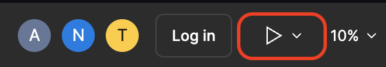
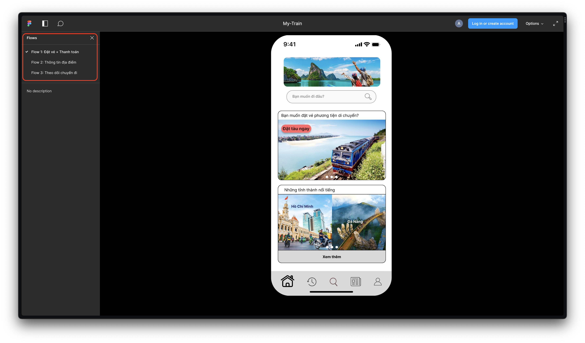
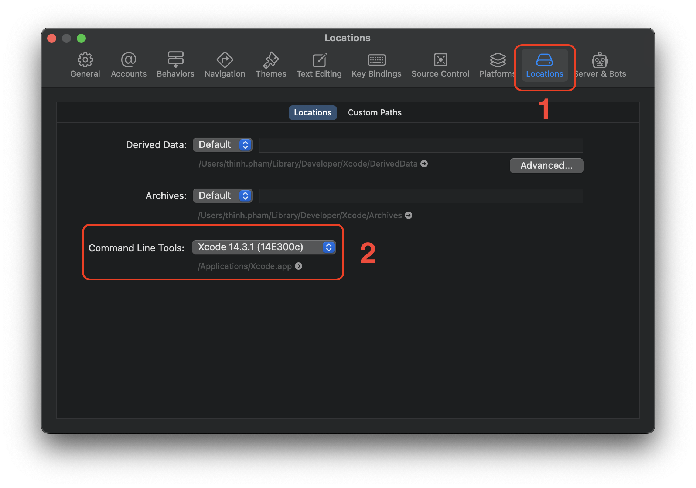

# Hướng dẫn sử dụng

<p>
  <!-- iOS -->
  
  <!-- Android -->
  
</p>

## Các thông tin cơ bản về chương trình demo

- Tài liệu hướng dẫn để cài đặt và chạy chương trình đã có trên [GitHub repository](https://github.com/teddythinh/UI-Design-Course) của nhóm, bao gồm cả [tiếng Việt](https://github.com/teddythinh/UI-Design-Course/blob/main/my-train-app/HuongDanSuDung.md) và [tiếng Anh](https://github.com/teddythinh/UI-Design-Course/blob/main/my-train-app/README.md).
- Với demo này, nhóm sẽ thực hiện trên di động, bao gồm cả hai hệ điều hành Android và iOS.
- Demo có đầy đủ 3 scenario với các screen tương ứng.
- Đối với giao diện demo sẽ có một chút sự khác biệt so với thiết kế gốc trên Figma, chủ yếu là các component thể hiện do sự hạn chế về các component trên thị trường và các icon để phù hợp với ngữ cảnh.
- Logic giữa các bước trong một scenario là hợp lý.
  - Ví dụ như scenario về đặt vé sẽ đi theo trình tự như sau: Tìm kiếm > Chọn tàu, chọn chỗ > Nhập thông tin cơ bản > Thanh toán.
- Dữ liệu hiện tại là dữ liệu động vì chưa có bước xử lý dữ liệu phía sau.

## Computer Prototype

Nhóm thiết kế Prototype thông qua [Figma](https://www.figma.com/file/uBif5vsZVJyyYg0gNbhU2s/My-Train?type=design&node-id=0%3A1&mode=design&t=pmaKX0w63tv4crL2-1).

Khi chọn link Figma, ta chọn vào nút Present ở góc phải trên cùng của giao diện.



Sau đó, ta thấy được giao diện để tương tác và các flow để tương tác tương ứng.



## Cấu hình

- Windows 11
- MacOS Ventura 13.5
- Xcode 14.3.1 (14E300c)

### Điều kiện cần

- NodeJS phiên bản mới nhất hoặc từ 16 trở lên.
- Homebrew nếu xài MacOS.

> **CHÚ Ý:** Vì thư viện Kitten UI bản mới nhất đang có xung đột với Expo SDK 49 nên bạn phải install các packages với cờ `--force` hoặc có thể hạ phiên bản Expo SDK xuống 48.

## Cài đặt

Ta dùng lệnh sau để clone repo xuống:

```bash
git clone https://github.com/teddythinh/UI-Design-Course.git
```

Sau đó, ta chuyển vào thư mục `my-train-app`:

```bash
cd my-train-app
```

Ta cài đặt các packages qua lệnh:

```bash
npm install
```

hoặc nếu sử dụng yarn

```bash
yarn install
```

## Sử dụng

Có hai cách chạy app mà nhóm sử dụng:

### Cách 1: Sử dụng ứng dụng Expo Go thông qua thiết bị thật **(Recommend)**

1. Ta cần cài ứng dụng Expo Go thông qua Google Play Store trên thiết bị Android hoặc Appstore trên thiết bị iOS.
2. Ta chạy lệnh:

- `npm start` hoặc
- `npx expo start`

3. Lúc này, trên terminal sẽ xuất hiện mã QR code, bạn cần quét mã thông qua ứng dụng Expo Go (Android) hoặc máy ảnh (iOS).
4. Ứng dụng sẽ cài đặt và chạy.

### Cách 2. Sử dụng các máy ảo Android hoặc iOS

> Theo dõi [React Native doc](https://reactnative.dev/docs/environment-setup) để xem chi tiết cài đặt.
> Theo dõi [Android Studio Emulator doc](https://docs.expo.dev/workflow/android-studio-emulator/) và [iOS Simulator doc](https://docs.expo.dev/workflow/ios-simulator/) để xem chi tiết cài đặt.

Vì project này sử dụng MacOS, nhóm sẽ hướng dẫn cài đặt trên máy ảo iOS.

1. Cài đặt Node và Watchman: Nếu bạn đã cài đặt Node từ trước thì chỉ cần cài đặt Watchman.

> Lưu ý: Nhóm cài đặt các package thông qua [Homebrew](https://brew.sh/).

```bash
brew install node
brew install watchman
```

2. Cài đặt Xcode thông qua [Mac App Store](https://apps.apple.com/us/app/xcode/id497799835?mt=12).

3. Cài đặt Command Line Tools trong Xcode:

- Mở Xcode, chọn Xcode > Settings (hoặc Preferences) từ menu.
- Chọn panel Locations, chọn version gần nhất từ Command Line Tools. Lưu ý, phần này cần nhấp  vào dropdown và nhấp vào chọn vì để mặc định có thể máy sẽ chưa cài xuống.



4. Cài đặt CocoaPods:

```bash
sudo gem install cocoapods
```

> Lưu ý: Nếu CocoaPods yêu cầu cài đặt `activesupport` hoặc các package liên quan từ Gem, bạn cần dùng lệnh `sudo` trước lệnh `gem`.

5. Ta chạy lệnh:

- `npm start` hoặc
- `npx expo start`

6. Bấm phím `i` để mở trình máy ảo iOS.
